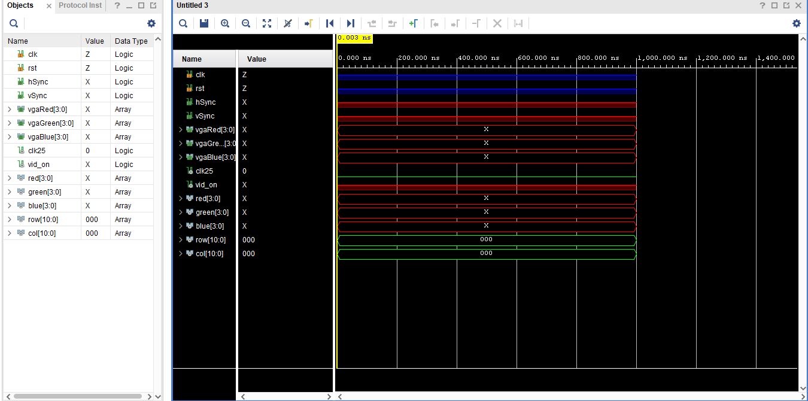
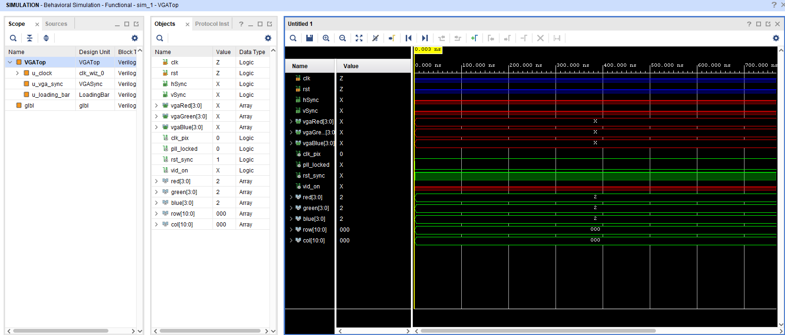

Welcome to my Project!
In my project, I aim to display a loading screen thorugh VGA Port on 720p Resolution.

## **Template VGA Design**
### **Project Set-Up**
  I began to my project by creating a new Vivado Project. Accurate board (Basys3) was picked while creating the project. 
We were given a VGASync, VGATop and XDC Constraints file beforehand. All additional functionality (Loading Bar, ColourStripes) was implemented in Verilog.  
After coding was done,  
1- Synthesis 
2- Implemantation 
3- Bitstream Generation  
runned in sequence. Once the bitstream was created successfully, it was programemd onto Basys3 board to test VGA output. 

## **Template Code**
The template code we got is a basic VGA test setup. The VGASync module creates all the timing for the screen, like hsync, vsync, and the row/col values, so we know which pixel is being drawn. The ColourStripes module then uses the col value to choose a colour, which is why it shows simple colour stripes.

The testbench acts as a main and connects everything together. It makes a clock, gives a reset, and then runs the VGA timing plus the ColourStripes module. When you simulate it, you can watch the row, col, and RGB values changing, which shows that the VGA timing is working. This template is what I later replaced with my own LoadingBar design.

### **Simulation**
Simulation is testing our hardware design on the computer to make sure the signals and outputs behave correctly before using the FPGA. It lets us see if the code is working by showing the signal levels over time.

In my simulation screenshot the lines were flat the whole time, so I researched why this was happening. I found out that it was because the simulation was still at the very beginning and the pixel clock wasn’t active yet. If the simulation ran longer, the row and col counters would start changing and the design would show real activity on the waveform.
### **Synthesis**

Before synthesis, we can see the elaborated design which basically shows the pure Verilog view of our modules. After running synthesis, Vivado converts the code into real FPGA hardware, so we can now see the registers, wires, and how everything connects internally. After that, implementation places and routes all of the connections onto the actual FPGA chip. This step makes sure the design will work on the board so we can get the image on our screen.

### **Demonstration**

Here is my screenshots for my outputs. As seen on the images my display is at 720p.

## **My VGA Design Edit**
For this project, my main idea was to create a loading bar animation that looks like a real-world loading screen, and to display it in full 720p resolution. I think this is very achievable as long as I understand the timing values and how the VGA modules work together. I researched standard 720p timings online (for example:
https://projectf.io/posts/video-timings-vga-720p-1080p/
) and used those values to make sure my design would work on a real monitor. Once the timing was correct, creating the loading bar animation itself was mainly about controlling the row/column values and updating the bar at the right speed.

### **Code Adaptation**
After I started my project, the first thing I changed was the timing values in the VGASync module. My goal was to get a 720p image on the screen, so I looked up the correct 720p timing parameters online and replaced the original 480p values in the template code. This allowed my VGA system to output the right resolution.

Next, I replaced the ColourStripes module with my own LoadingBar module. I wanted a loading screen that starts red and fades into green as it fills up. I set limits for which rows the bar should appear in, and I updated the bar every clock. At first it was way too fast, so I added a counter and a flag to update the bar only every 8,000,000 clock cycles. This slowed it down enough to actually see the loading effect on the screen.

## **FOR VGA TOP** 
<table>
  <tr>
    <td></td>
    <td></td>
  </tr>
</table>

- I changed the VGATop module and added a "rst_sync" which keeps everything in reset until the clock is ready, so my VGA timing starts clean and avoids glitches on the screen.
- I changed the clock name from clk_25 to clk_pix since my clock speed is different to get 720p on the screen.
- I added the clock module because VGA timing and pixel drawing must run at a precise speed, and the PLL inside VGATop uses that input clock to create the required pixel clock. 

## **FOR VGA SYNC**
<table>
  <tr>
    <td></td>
    <td></td>
  </tr>
</table>
The original VGASync module was made for 480p, so I updated all the timing values to match 720p resolution. Since 720p needs a faster pixel rate, I also changed the pixel clock to 74.25 MHz, which is the standard for 1280×720 @ 60Hz.

Inside the module, the main counters are hcount and vcount:

- hcount increases every pixel clock and keeps track of the current horizontal pixel on the screen.

- When hcount reaches the horizontal limit, it resets back to 0 and vcount increases, which moves us to the next line.

This is just how a real monitor draws an image: it goes left-to-right for each line, then moves down to the next one. When vidon is 1, it means we are in the visible part of the screen, so the monitor actually show the pixels. That’s what creates the final 720p frame.

### **For Loading Bar**  
<table>
  <tr>
    <td></td>
    <td></td>
    <td></td>
  </tr>
</table>

I completely changed the ColourStripes module into my LoadingBar module to simulate a loading bar effect on the screen. I added extra registers such as:

- 'slow' to slow down the update rate so the loading animation is visible,
- 'progress' to track which column the bar is currently at,
- 'slowFlag' to make sure I only update the bar after a certain number of clock cycles,
- 'red_tmp' and 'green_tmp' to create the fading effect on the bar.

I added an if statement that checks if both row and col are 0. This makes sure the screen is about to start drawing a new frame.
When that happens, I update my progress value so the loading bar moves correctly. I also added a small template of “Loading…” text which I got from ChatGPT.

At the end of my code, I added an else-if statement to limit the loading bar to specific rows (top and bottom). Inside those rows, I draw the actual bar. As the column increases, the red value goes down and the green value goes up, which creates the fading effect. That’s how I achieved the smooth color gradient on the loading bar.
### **Simulation**

For simulation, I used the Vivado simulator to test my design before using the FPGA. In my screenshot the signals look flat because the simulation was only at the very start, and the pixel clock needs more time before the VGA counters start updating. VGA works very fast, so it takes a lot of clock cycles before we can see any changes in the waveforms.

If the simulation ran longer, the row, col and RGB signals would start changing as the screen is drawn. This shows that the simulation setup is correct and the design would work properly on the board.

### **Synthesis**

  
After synthesis , Vivado shows how my design is connected in the RTL and implemented schematics. In the first picture, you can see the RTL diagram of my full design. It clearly shows how the clk_wiz block creates my pixel clock, how VGASync generates the row/col values, and how my LoadingBar module takes those values and outputs the RGB signals. This looks different from the original design because the ColourStripes module has been replaced with my custom loading bar, and there is extra logic for the fading effect and slowdown counter.
### **Demonstration**
<table>
  <tr>
    <td></td>
    <td></td>
    <td></td>
  </tr>
</table>

## **More Markdown Basics**
This is a paragraph. Add an empty line to start a new paragraph.

Font can be emphasised as *Italic* or **Bold**.

Code can be highlighted by using `backticks`.

Hyperlinks look like this: [GitHub Help](https://help.github.com/).

A bullet list can be rendered as follows:
- vectors
- algorithms
- iterators

Images can be added by uploading them to the repository in a /docs/assets/images folder, and then rendering using HTML via githubusercontent.com as shown in the example below.

