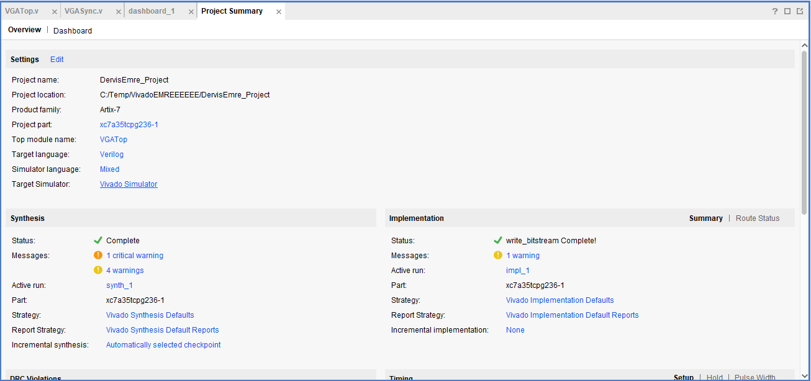

Welcome to my Project!
In my project, I aim to display a loading screen thorugh VGA Port on 720p Resolution.

## **Template VGA Design**
### **Project Set-Up**
  I began to my project by creating a new Vivado Project. Accurate board (Basys3) was picked while creating the project. 
We were given a VGASync, VGATop and XDC Constraints file beforehand. All additional functionality (Loading Bar, ColourStripes) was implemented in Verilog.  
After coding was done,  
1- Synthesis 
2- Implemantation 
3- Bitstream Generation  
runned in sequence. Once the bitstream was created successfully, it was programemd onto Basys3 board to test VGA output. 

### **Template Code**
Outline the structure and design of the Verilog code templates you were given. What do they do? Include reference to how a VGA interface works. Guideline: 2/3 short paragraphs, consider including screenshot(s).
In the verilog code template, user can display different colours by sequence, or display them all at once as colour stripes.

VGATop code is like the main where verilog code starts running. It connects LoadingBar simulation code and VGASync code to display the Loading Bar on the screen.

### **Simulation**
Explain the simulation process. Reference any important details, include a well-selected screenshot of the simulation. Guideline: 1/2 short paragraphs.
### **Synthesis**
Describe the synthesis and implementation processes. Consider including 1/2 useful screenshot(s). Guideline: 1/2 short paragraphs.
### **Demonstration**
Perhaps add a picture of your demo. Guideline: 1/2 sentences.

## **My VGA Design Edit**
Introduce your own design idea. Consider how complex/achievabble this might be or otherwise. Reference any research you do online (use hyperlinks).
### **Code Adaptation**
Briefly show how you changed the template code to display a different image. Demonstrate your understanding. Guideline: 1-2 short paragraphs.
### **Simulation**
Show how you simulated your own design. Are there any things to note? Demonstrate your understanding. Add a screenshot. Guideline: 1-2 short paragraphs.
### **Synthesis**
Describe the synthesis & implementation outputs for your design, are there any differences to that of the original design? Guideline 1-2 short paragraphs.
### **Demonstration**
If you get your own design working on the Basys3 board, take a picture! Guideline: 1-2 sentences.

## **More Markdown Basics**
This is a paragraph. Add an empty line to start a new paragraph.

Font can be emphasised as *Italic* or **Bold**.

Code can be highlighted by using `backticks`.

Hyperlinks look like this: [GitHub Help](https://help.github.com/).

A bullet list can be rendered as follows:
- vectors
- algorithms
- iterators

Images can be added by uploading them to the repository in a /docs/assets/images folder, and then rendering using HTML via githubusercontent.com as shown in the example below.

