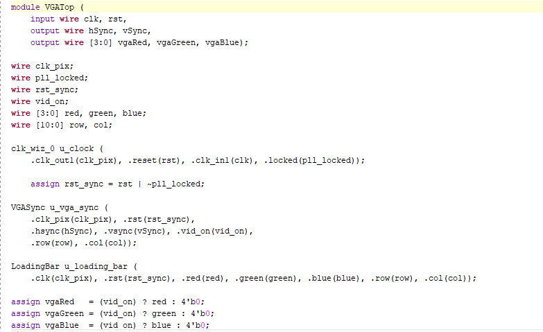
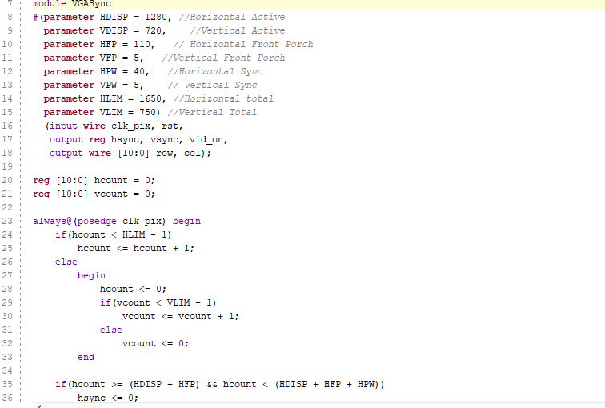
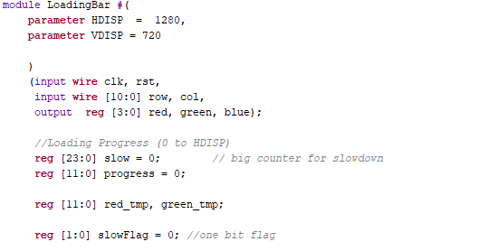
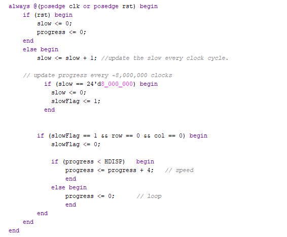
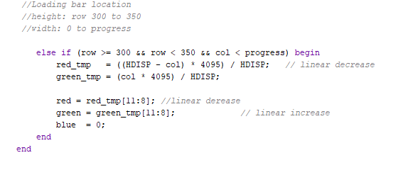

Welcome to my Project!
In my project, I aim to display a loading screen thorugh VGA Port on 720p Resolution.

## **Template VGA Design**
### **Project Set-Up**
  I began to my project by creating a new Vivado Project. Accurate board (Basys3) was picked while creating the project. 
We were given a VGASync, VGATop and XDC Constraints file beforehand. All additional functionality (Loading Bar, ColourStripes) was implemented in Verilog.  
After coding was done,  
1- Synthesis 
2- Implemantation 
3- Bitstream Generation  
runned in sequence. Once the bitstream was created successfully, it was programemd onto Basys3 board to test VGA output. 

## **Template Code**
The template code we got is a basic VGA test setup. The VGASync module creates all the timing for the screen, like hsync, vsync, and the row/col values, so we know which pixel is being drawn. The ColourStripes module then uses the col value to choose a colour, which is why it shows simple colour stripes.

The testbench acts as a main and connects everything together. It makes a clock, gives a reset, and then runs the VGA timing plus the ColourStripes module. When you simulate it, you can watch the row, col, and RGB values changing, which shows that the VGA timing is working. This template is what I later replaced with my own LoadingBar design.

### **Simulation**
Explain the simulation process. Reference any important details, include a well-selected screenshot of the simulation. Guideline: 1/2 short paragraphs.
### **Synthesis**
Describe the synthesis and implementation processes. Consider including 1/2 useful screenshot(s). Guideline: 1/2 short paragraphs.
### **Demonstration**
Perhaps add a picture of your demo. Guideline: 1/2 sentences.

## **My VGA Design Edit**
Introduce your own design idea. Consider how complex/achievabble this might be or otherwise. Reference any research you do online (use hyperlinks).

With this project i am planning to do a loading screen which includes a bar that start to fade from red to green. After its finished it should restart itself from the beggining.
Addition to this i am planning to add a Loading text above the bar.

### **Code Adaptation**
Briefly show how you changed the template code to display a different image. Demonstrate your understanding. Guideline: 1-2 short paragraphs.
I changed my the three modules that we were given. 

## **FOR VGA TOP** 
<table>
  <tr>
    <td></td>
    <td></td>
  </tr>
</table>

- I changed the VGATop module and added a "rst_sync" which keeps everything in reset until the clock is ready, so my VGA timing starts clean and avoids glitches on the screen.
- I changed the clock name from clk_25 to clk_pix since my clock speed is different to get 720p on the screen.
- I added the clock module because VGA timing and pixel drawing must run at a precise speed, and the PLL inside VGATop uses that input clock to create the required pixel clock. 

## **FOR VGA SYNC**
<table>
  <tr>
    <td></td>
    <td></td>
  </tr>
</table>
The original VGASync module was made for 480p, so I updated all the timing values to match 720p resolution. Since 720p needs a faster pixel rate, I also changed the pixel clock to 74.25 MHz, which is the standard for 1280×720 @ 60Hz.

Inside the module, the main counters are hcount and vcount:

- hcount increases every pixel clock and keeps track of the current horizontal pixel on the screen.

- When hcount reaches the horizontal limit, it resets back to 0 and vcount increases, which moves us to the next line.

This is just how a real monitor draws an image: it goes left-to-right for each line, then moves down to the next one. When vidon is 1, it means we are in the visible part of the screen, so the monitor actually show the pixels. That’s what creates the final 720p frame.

### **For Loading Bar**  
<table>
  <tr>
    <td></td>
    <td></td>
    <td></td>
  </tr>
</table>

I completely changed the ColourStripes module into my LoadingBar module to simulate a loading bar effect on the screen. I added extra registers such as:

- 'slow' to slow down the update rate so the loading animation is visible,
- 'progress' to track which column the bar is currently at,
- 'slowFlag' to make sure I only update the bar after a certain number of clock cycles,
- 'red_tmp' and 'green_tmp' to create the fading effect on the bar.

I added an if statement that checks if both row and col are 0. This makes sure the screen is about to start drawing a new frame.
When that happens, I update my progress value so the loading bar moves correctly. I also added a small template of “Loading…” text which I got from ChatGPT.

At the end of my code, I added an else-if statement to limit the loading bar to specific rows (top and bottom). Inside those rows, I draw the actual bar. As the column increases, the red value goes down and the green value goes up, which creates the fading effect. That’s how I achieved the smooth color gradient on the loading bar.
### **Simulation**
Show how you simulated your own design. Are there any things to note? Demonstrate your understanding. Add a screenshot. Guideline: 1-2 short paragraphs.
### **Synthesis**
Describe the synthesis & implementation outputs for your design, are there any differences to that of the original design? Guideline 1-2 short paragraphs.
### **Demonstration**
If you get your own design working on the Basys3 board, take a picture! Guideline: 1-2 sentences.

## **More Markdown Basics**
This is a paragraph. Add an empty line to start a new paragraph.

Font can be emphasised as *Italic* or **Bold**.

Code can be highlighted by using `backticks`.

Hyperlinks look like this: [GitHub Help](https://help.github.com/).

A bullet list can be rendered as follows:
- vectors
- algorithms
- iterators

Images can be added by uploading them to the repository in a /docs/assets/images folder, and then rendering using HTML via githubusercontent.com as shown in the example below.

